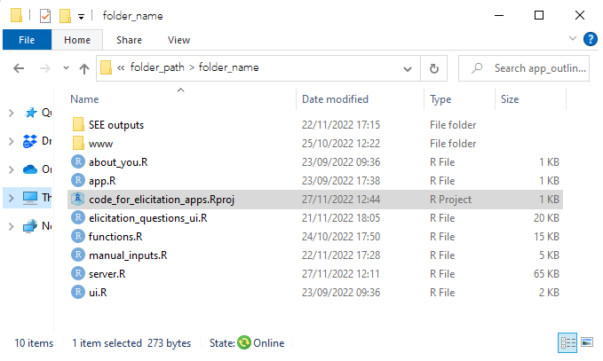
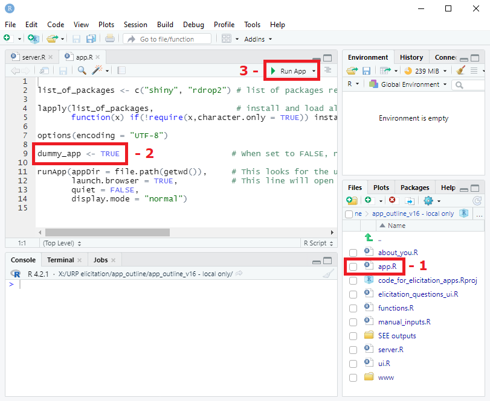
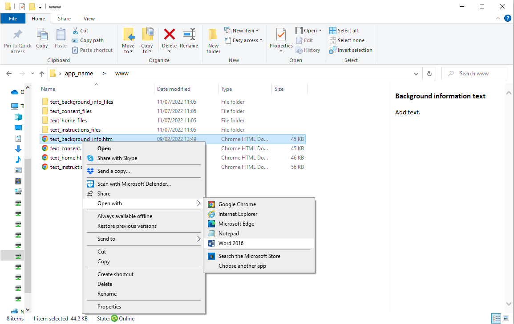
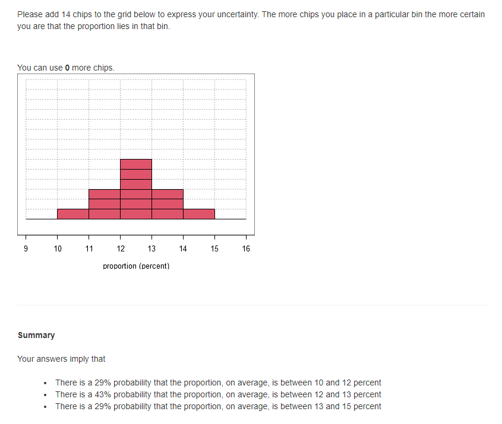

# Instructions for building STEER Shiny apps in R

The downloadable R code produces a Shiny app for a generic elicitation exercise with four hypothetical parameters.

## Why use the R-based tool to conduct SEE?

**Easy to customise**

The can be customised to produce bespoke Shiny apps for conducting structured expert elicitation. The resulting apps can use Chips and Bins (also known as Roulette or Histogram method), tertiles or quartiles (also referred to as bisection) elicitation methods.

To use the materials, please cite *Jankovic D, Soares M, Bojke L, Horscroft J, Lee D. R code for building bespoke Shiny apps for conducting SEE. STEER. 2022*.

**Easy to disseminate**

You can deploy your bespoke app to a webpage and disseminate them simply by sending the link and a unique ID to each expert. Experts’ answers will be saved on their device in a single file that can be sent back to you.

**Easy to analyse**

The tool includes code for analysing experts’ answers, including fitting and visualising parametric distributions to experts’ probabilities, and aggregating responses from multiple experts.

## Instructions for creating your app

To design your bespoke app, follow these five steps:

1. Download the R code from GitHub (https://github.com/jankovicd/code_for_elicitation_apps)

2. Open the “code_for_elicitation_apps.Rproj” file in RStudio

3. Run the dummy app to explore the app content:
* Open the app.R file from RStudio
* Check that the app is set to “dummy” mode (dummy_app <- TRUE) in app.R file.
* Click on “Run App” in the top right corner of the R script

4. Customise the app by:
* Opening and editing the manual_inputs.R file in RStudio,
* Opening and editing the about_you.R file in RStudio,
* Editing text files from the “www” folder.

For details, see How to customise your app.

5. Disseminate your bespoke app:
* Check that the app is set to “live” mode (dummy_app <- FALSE) in app.R file
* Open a free account with shinyapps.io
* Click on the “Publish application” button in RStudio ( icon in the top right corner of RStudio) and follow the onscreen instructions.

For other methods to disseminate your app, visit the [share your appp Shiny tutorial](https://shiny.rstudio.com/tutorial/written-tutorial/lesson7/).

## How to customise your app

The Shiny apps for expert elicitation include:
* A “Home” page that includes a consent form and dummy questions about experts completing the exercise. The consent form and the questions about experts can be edited or removed.
* An “Instructions” tab that explains the difference between uncertainty and variability, and instructions for how to complete the exercise. The instructions are specific to the elicitation method selected by the user (chips and bins, tertiles or quartiles) and the text can be edited.
* A dummy “Background information” tab that can be edited to provide any relevant background information (project details, relevant literature) to experts;
* A “Questions” tab that contains a series of sub-tabs, one for each elicitation question. The number of questions, the text and the elicitation method can be modified by the user. The app can include one of three elicitation methods: Chips and Bins, also referred to as Roulette or Histogram method, tertiles or quartiles, also referred to as the bisection method, but only one method can be used per app.

### How to edit text on the “Home” page, “Instructions” and “Background information“

Text on the home page, the consent form, instructions and background information can all be edited in word. The basic content is provided in four htm files in the “www” folder. To edit the text:
1. Right-click on the relevant htm file;
2. Select “Open with”;
3. Select “Word”.

 
Once you have finished editing the file, save it as a htm file, overwriting the original.

For guidance on the type of information that should be included in an elicitation exercise, see the [step-by-step guide to SEE](https://www.york.ac.uk/che/research/teehta/elicitation/steer/).

### How to edit elicitation questions

App content and elicitation questions can be edited in the “manual_inputs.R” file. To create a bespoke app, you must edit the following parameters in the file:

**a)	The list of unique identifiers for individual experts participating in the study**

When you run the “live” app (when dummy_app <- FALSE in app.R file), each expert will be asked to enter a unique identifier to complete the exercise. This is a number that should be provided to experts in advance. The identifier is used to save experts' answers, and to retrieve previous answers when they complete the exercise in multiple sittings. Note that there should be one unique ID per expert invited to take part, otherwise they will overwrite each other’s answers.

Use “all_expert_ids“ vector to define the list of unique identifiers used in the study, where each element corresponds to the unique identifier provided to one expert, and the length of the vector equals the total number of experts who are invited to take part.

**b)	Whether to include a consent form in the app**

Set “include_consent” object to TRUE if consent form is included, or FALSE if they are not.

**c)	Whether to include questions about experts**

Set “include_about_you” object to TRUE if questions are included or FALSE if they are not. The questions are entered in a separate file, described in How to edit “About you” questions.

If “include_about_you” is set to TRUE, you must specify the total number of questions about experts in the “n_about_you” object.

**d)	Elicitation method**

Set “elicitation_method” object to “chips and bins”, “quartiles” or “tertiles”. Note that Chips and Bins are sometimes referred to as Roulette or Histogram, while quartiles are sometimes referred to as bisection.

**e)	Quantities being elicited**

Use “quantity” vector to define quantities being elicited (e.g. proportions, time, change in utility, etc.), so that each element corresponds to one elicitation question and the length of the vector equals the total number of elicitation questions.

**f)	Units for each quantity being elicited**

Set “units” vector so that each element corresponds to one elicitation question and the length of the vector equals the total number of elicitation questions. When a quantity has no units, set to “”.

**g)	Lower and upper limit of each quantity being elicited**

Use “quant_limit_lower” and “quant_limit_upper” vectors to define upper and lower limits of each parameter, so that each element corresponds to one elicitation question and the length of each vector is equal to the total number of elicitation questions. When a parameter has no limit, set to NA.

**h)	Elicitation questions**

Use “eli_que_text” vector where each element corresponds to one elicitation question so that the length of the vector equals the total number of elicitation questions.

**i)	Whether to lock the app content so that experts must click through each tab to complete the exercise, preventing skips between tabs**
Set “conditional_release” to TRUE to force experts to complete each section or FALSE to make all tabs visible at all times. “conditional_release” is usually set to FALSE while editing the app, then TRUE in the final, published version.

### How to edit “About you” questions

If c) in maual_inputs.R is set to TRUE, the questions about experts should be added to the “about_you.R” file, using [standard Shiny widgets](https://shiny.rstudio.com/gallery/widget-gallery.html). Two examples are provided in the supplied code.

## Details on elicitation methods in the app

The Shiny app content and design are based on the methods in the protocol for structured expert elicitation (SEE) funded by the Medical Research Council (MRC) written by [Bojke et al. (2022)](https://www.ncbi.nlm.nih.gov/books/NBK571051/) and the subsequent [step-by-step guide to SEE](https://www.york.ac.uk/che/research/teehta/elicitation/steer/) written as a collaboration between the [Centre for Health Economics](https://www.york.ac.uk/che/) at the University of York and [Lumanity](lumanity.com).

The app can include one of three elicitation methods: Chips and Bins (also referred to as Roulette or Histogram method), Tertiles and Quartiles (also referred to as the bisection method). Tertiles and Quartiles are two different types of variable interval methods.
All elicitation methods first elicit the plausible range.

If using Chips and Bins, experts are then presented with a plot where they can express their uncertainty. The range on the x-axis of the plot is always slightly wider than the expert’s range, unless this is prevented by the limits of the parameter being elicited (e.g. if an experts’ lower limit is 0%, then the lower limit of the plot is also 0%). The bin-width on the plot (i.e. the range of intervals on the histogram) can take value of 1, 2 or 5, or their multiple of 10, 100 or 1000. The exact bin width is derived to make the total number of bins as close to 10 as possible.

If using either of the variable interval methods, experts are then asked to provide their quartiles or tertiles.

Once experts have expressed their uncertainty using the relevant method, they are presented with feedback on their quantities.

With Chips and Bins, the feedback includes the probability placed on expert’s mode range, and the probability on either side of the mode.

With the variable interval methods, the feedback includes comparison of different parameter ranges (e.g. the proportion is equally likely to be between 20% and 40%, as it is to be outside this range).

Experts are then asked to provide rationale for their answers, and save them. Experts can also edit and re-save their answers at any point in the exercise.

# Analysis code

The R code includes files required to analyse elicitation responses collected using the STEER Shiny app. 

Once all relevant files are aggregated in the relevant folder, the code fits distributions of choice (normal, log normal, beta, gamma) to experts’ priors using SHELF fitdist function (7) and produces aggregate distributions with equal weighting. The code saves tables of experts’ individual and pooled distribution parameters, as well as plots comparing fitted distributions with experts’ quantiles and plots comparing individual with aggregate probability distributions for each elicitation question.

To run the analysis: 
* Save all elicitation responses in one folder (“analysis_files/experts_responses” in the project folder).
* Name all files with experts' responses in the following format: expertID_doanload_all.csv (where expertID is the expert's unique ID)
* Open the analysis_code.R file from RStudio.
* Select which distributions to fit in each elicitation question by setting the “dist_per_question” object.
* Run the code
* Read the results in the “analysis_files/experts_responses” folder in the project folder.

The code is open source and can be edited to add further options (such as multiple distributions per elicitation question, or fitting additional parametric distributions).

